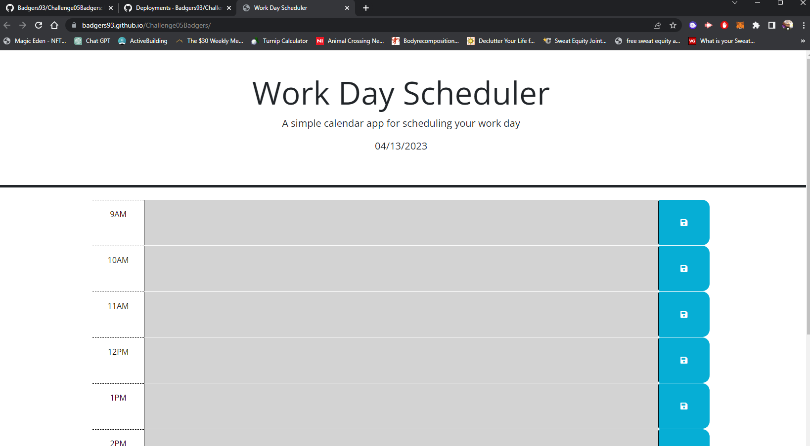

# Challenge05Badgers

## Description
Day planner using jquery, css, and html.

## Functionality
Allows one to input text into the planner which will be saved when leaving and coming back to the site.
Also shows different color codes depending on the current hour relative to the time block.

## Usage
Link to website: https://badgers93.github.io/Challenge05Badgers/

